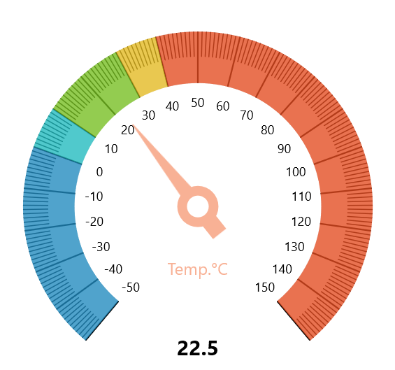

# Overview

Syncfusion winui radial gauge is a data visualization control, to create modern, interactive, and animated gauge that is used to craft high-quality winui app user interfaces.

## Key Features

* **Axes** - The radial gauge axis is a circular arc in which a set of values are displayed along a linear or custom scale based on the design requirements. Axis elements, such as labels, ticks, and axis line, can be easily customized with built-in properties
* **Ranges** - Gauge range is a visual element that helps to quickly visualize a value where it falls on the axis.
* **Pointers** - Pointer is used to indicate values on an axis. Radial gauge has three types of pointers: needle pointer, marker pointer, and range pointer. All the pointers can be customized as needed.
* **Pointer animation** - Animates the pointer in a visually appealing way when the pointer moves from one value to another.
* **Pointer interaction** - Radial gauge provides an option to drag a pointer from one value to another. It is used to change the value at run time.
* **Annotations** - Adds multiple controls such as text and image as an annotation at a specific point of interest in the radial gauge.

You can get the sample in the following link: [`WinUI Gauges`]().