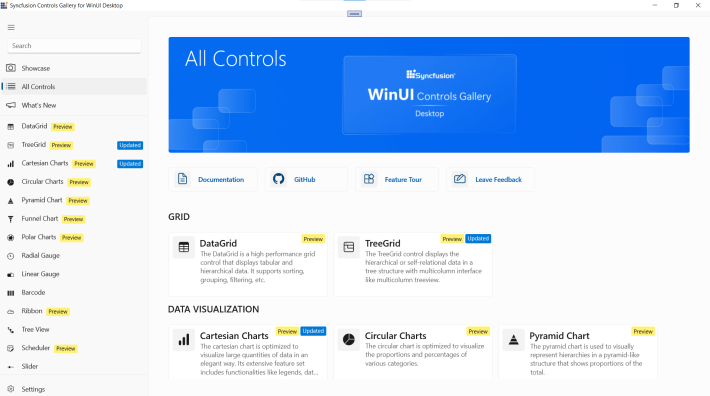

# Featured Samples for Syncfusion&reg; WinUI Controls

## Syncfusion&reg; WinUI control panel

To explore Syncfusion&reg; WinUI controls and components, open the `Syncfusion&reg; WinUI Controls Panel` by searching it from Start and Open. 

In another way, open the Control Panel from the following installed location.

C:\Program Files (x86)\Syncfusion\Essential Studio\WinUI\{{ site.releaseversion }}\Infrastructure\Launcher\Syncfusion WinUI Control Panel.exe 

N> In the above section, latest Essential Studio&reg; version details has been provided. Refer installed Essential Studio&reg; version instead of mentioned version.

## Syncfusion&reg; Controls Gallery for WinUI Desktop

The Syncfusion&reg; WinUI desktop controls can be explored in the Visual Studio by clicking `Run Local Demos`.
 
 

## Offline samples

* The individual control samples can also be run by exploring the individual control project.

For example, following is a demonstration to run an individual `Chart` control project in Visual Studio.

* Open a standalone executable project desktop (not a lib project) in the Visual Studio, which is available under the category name.

 

* Build and deploy the individual control executable project, then run the application.

All the sample browser projects are configured as single SDK-style projects that support multiple frameworks: `.NET 8.0`, `.NET 9.0`, and `.NET 10`. 

When you click the `Run Local Demos` or `Explore Demo Source` button, the  `net10.0-windows` entry will be automatically removed from the targets file if `.NET 10` is not installed on your machine, preventing any compilation errors. 

To use the `.NET 10 framework`, install the required SDK and add `net10.0-windows` to the < TargetFrameworks > tag in the `MultiTargeting.targets` file located at the Samples Location:[D:\WinUI31.2.9\WinUI\31.2.9\SampleBrowser\targets\MultiTargeting.targets] as shown in the image below. 

## Online Sample

* Download and install demos from [Microsoft Store](https://www.microsoft.com/en-in/p/syncfusion-winui-controls-gallery/9n0fp16ddc06?activetab=pivot:overviewtab).

## Download demos from online (clone from github repository)

Explore the Syncfusion&reg; WinUI controls using [GitHub WinUI demos](https://github.com/syncfusion/winui-demos), where all WinUI demos are configured using `NuGet` to run without installing Syncfusion&reg; WinUI Studio.