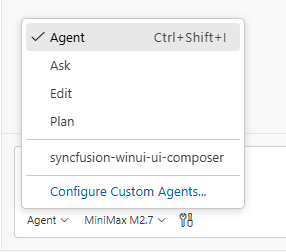

# Syncfusion® WinUI UI Composer Skill for AI Assistants

**Syncfusion® WinUI UI Composer** is an AI-powered skill and companion agent that accelerates WinUI application development by transforming natural-language UI requirements into production-ready controls using Syncfusion® WinUI libraries. 

Integrated with your AI-powered IDE, it leverages deep knowledge of **Syncfusion® controls** to deliver accurate and ready-to-use code.
By combining intelligent code generation with best practices, accessibility standards, and design-system consistency, WinUI UI Composer helps you rapidly build scalable dashboards and user interfaces without leaving your development workflow.

## Prerequisites

Before installing WinUI UI Composer, ensure the following:

- Install [APM (Agent Package Manager)](https://microsoft.github.io/apm/getting-started/installation/#quick-install-recommended)
- Required [.NET SDK](https://dotnet.microsoft.com/en-us/download) version ≥ 6
- WinUI application (existing or new); see [Overview](https://help.syncfusion.com/Winui/overview)
- A supported AI agent or IDE that integrates with the Skills (VS Code, Cursor, Syncfusion® Code Studio, etc.)
- Active Syncfusion<sup style="font-size:70%">&reg;</sup> license(any of the following):  
  - [Commercial](https://www.syncfusion.com/sales/unlimitedlicense)  
  - [Community License](https://www.syncfusion.com/products/communitylicense)  
  - [Free Trial](https://www.syncfusion.com/account/manage-trials/start-trials)

## Key Benefits

### **AI-Driven UI Generation**
- Converts prompts into complete WinUI components—not just snippets
- Automatically selects appropriate Syncfusion® controls and features
- Produces structured, maintainable code

### **Control Usage & API Accuracy**
- Uses correct Syncfusion® control APIs
- Injects required feature modules (paging, sorting, filtering, etc.)
- Avoids unsupported or deprecated patterns

### **Patterns & Best Practices**
- Recommended control composition and data binding patterns
- Event handling and command routing aligned with WinUI standards
- Secure and scalable coding patterns with proper resource management
- XAML-friendly code that works seamlessly in Visual Studio designer

### **Accessibility & Design System**
- Follows Windows accessibility guidelines (UIA and narrator support)
- Supports keyboard navigation and accessibility standards
- Theme consistency across WinUI desktop applications
- High DPI awareness and resolution support

### **Design-System Integration**
- Supports Syncfusion® WinUI themes (Fluent Light, Fluent Dark, Material Light, Material Dark, etc.)
- ResourceDictionary-based theming for consistent styling across applications
- Ensures consistent Syncfusion® styling and theme usage

## Installation

Before installing WinUI UI Composer, ensure that APM (Agent Package Manager) is installed and available in your environment.

### Verify APM Installation

Run the following command to confirm APM is installed:

```bash
apm --version
```

### Install the Syncfusion® WinUI UI Composer package using APM

Use the APM CLI to install the WinUI UI Composer skill for your preferred environment:




apm install syncfusion/winui-ui-composer -t copilot




apm install syncfusion/winui-ui-composer -t cursor




apm install syncfusion/winui-ui-composer -t copilot




apm install syncfusion/winui-ui-composer -t claude




After installation, the following artifacts are added to your project for the GitHub Copilot target:

- `.agent/skills/` – contains the skill files
- `.github/agents/` – contains the agent configuration

Refer to the [documentation](https://microsoft.github.io/apm/reference/cli/targets/#detection-signals) for details about supported deployment targets.

> For Syncfusion® Code Studio, use the Copilot command above to install the WinUI UI Composer.

## How the Syncfusion® WinUI UI Composer Skill Works

1. **Intent Analysis** — Parse the user's prompt to identify control types and high-level page/window layout intent.
2. **Project Detection** — Automatically detects .NET framework version (net6.0+) and existing Syncfusion® WinUI configurations.
3. **Control Mapping** — Map intent to Syncfusion® WinUI controls and required feature modules.
4. **Theming & Design System**  
   Load required theming guidelines and confirm key design choices:
   - Syncfusion® theme (Fluent Light, Fluent Dark, Material Light, Material Dark, etc.)
   - Core design basics (colors, fonts, control appearance, DPI awareness)
   - Light and Dark mode support
5. **Code Generation** — Produce C# and XAML WinUI controls, data bindings, event handlers, and styling.
6. **Dependency Management** — Recommend or install required Syncfusion® NuGet packages and .NET dependencies.
7. **Validation** — Run code compatibility and basic security checks, request confirmation for changes.
8. **Code Insertion** — Create Page/Window classes, User Controls, or patch existing files following WinUI conventions.

Key enforcement points:

- Adds correct theme ResourceDictionaries and styling configuration for chosen Syncfusion® themes
- Injects only the feature controls and behaviors required by generated controls
- Generates well-structured XAML markup with proper binding and command setup
- Follows WinUI patterns for control initialization and event handling
- Ensures all required Syncfusion® NuGet packages are referenced
- Avoids unsupported or deprecated API usages for Syncfusion® WinUI controls

> The assistant handles most stages automatically and may request confirmation where required.

## Using the AI Assistant

After installing WinUI UI Composer with APM, the relevant agent and skill files are added to your project under:

- `.agent/skills/` (skill files)
- `.github/agents/` (WinUI UI composer agent configuration, based on the selected target)

To start using the skill:

1. Open your supported IDE.
2. In the chat panel, select the `syncfusion-winui-ui-composer` agent from the **Agent dropdown**.



3. Start prompting the agent with a clear description of your UI requirements.

Examples Prompts:



Create a login page using the Fluent Light theme with a centered StackPanel containing email and password TextBox controls with validation. Include a "Remember Me" CheckBox, a forgot password Hyperlink, and a primary login Button. Add a secondary "Create Account" button below. Ensure the layout is well-organized and follows Windows desktop UI standards.


Create a CMS Admin Dashboard UI featuring a collapsible NavigationView in a left panel with menu items for Dashboard, Content, Users, Analytics, and Settings; a CommandBar header showing the title "CMS Admin Dashboard" on the left and user information on the right; and a main content area with a Grid layout containing three summary cards in a row displaying Total Content, Total Users, and Active Sessions (each showing a label, count value, and percentage change), followed by a "Content Management" section with a DataGrid containing columns for Title, Author, Status, Date, and Actions, and finally two charts displayed side by side—a bar chart titled "Content Over Time" and a pie chart titled "Content by Category"—using realistic sample data.



Generated code follows WinUI best practices with well-structured XAML markup, proper data binding patterns, strong C# typing, and built-in security measures such as input validation and avoidance of hardcore secrets.

## Best Practices

Follow these guidelines to get the most out of UI Composer and ensure high-quality production-ready results:

- **Stay consistent** — Maintain consistent file organization, naming conventions (PascalCase for classes, camelCase for properties), and WinUI coding standards throughout your project.
- **Use advanced AI models** — For best results, use **Claude Sonnet 4.6 or higher** capability models to produce better code quality and more accurate implementations.
- **Review all content before production** — Validate the logic, security, and compatibility with your existing code and target .NET version before deployment. Test control functionality within Visual Studio designer and at runtime.
- **Verify Syncfusion® licenses** — Ensure all required Syncfusion® WinUI controls have valid licenses before deploying to production.
- **Test accessibility** — Verify UIA support, keyboard navigation, and narrator compatibility for Windows accessibility standards.

## Troubleshooting

- **APM installation failure**: Refer to this [documentation](https://microsoft.github.io/apm/getting-started/installation/#troubleshooting)

- **Skills not loading**: Ensure the **.agent/** and **.github/agents/** folders exist in your project and that the skill was installed successfully using APM. Verify that the correct agent is selected from the Agent dropdown in your IDE.

- **Control not rendering**: Retry generation using the specific control skill to resolve the issue, and ensure required Syncfusion® packages and themes are properly configured.

- **Syncfusion license banner appears**: Use the licensing skill to correctly register and validate your Syncfusion® license key in the application.


## FAQ

**Which agents/IDEs are supported?**
Any Skills-compatible agent that reads local skill files (Code Studio, VS Code, Cursor, etc.).

**Are skills loaded automatically?**  
Yes. Supported agents automatically load relevant skills based on your query.

**Can I customize the generated styles?**
Yes — the generated WinUI controls include clear integration points for style adjustments.

**Does it modify files automatically?**
The skill proposes changes and requires confirmation for insertion; automatic dependency installation may be offered depending on agent permissions.

## See also

- [Agent Skills Standards](https://agentskills.io/home)
- [Agent Package Manager](https://microsoft.github.io/apm/getting-started/quick-start/)
