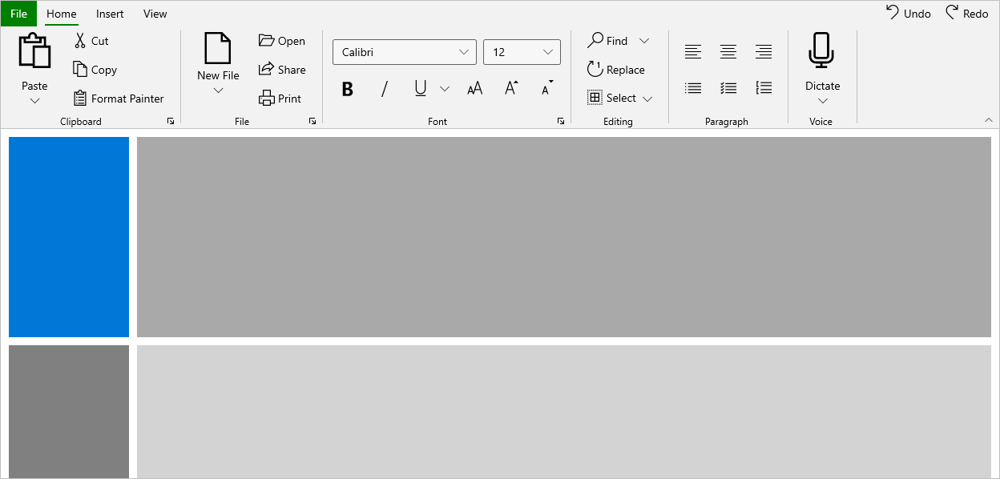

# Themes for Syncfusion WinUI Controls

Themes provides a sense of visual continuity for the Windows apps. It allows us to customize the appearance of the application. The theme affects the colors of the control's background, foreground, border brush, font etc. 

## Supported themes

Syncfusion WinUI controls supports Light and Dark themes. 

**Light theme**

**Dark Theme**
    

## Applying themes at application level

We can change theme for the whole application using the `RequestedTheme` property available in App.xaml. Syncfusion control adopts to theme setting, when it is applied through `RequestedTheme` property. 




    <Application
        x:Class="DemoApp.App"
        xmlns="http://schemas.microsoft.com/winfx/2006/xaml/presentation"
        xmlns:x="http://schemas.microsoft.com/winfx/2006/xaml"
        xmlns:local="using:WinUIDemoApp" RequestedTheme="Dark">
    </Application>





    sealed partial class App : Application

    {
        public App()
        {
            this.RequestedTheme = ApplicationTheme.Dark;
            this.InitializeComponent();
        }
    }




N> When the `RequestedTheme` property is not set, application will use the user's system settings.

## Applying themes for controls

Themes can also be applied for each framework element individually irrespective of the Application level themes. It can be set using the `RequestedTheme` property available in UIElements. When the `RequestedTheme` property is set to `Default` it uses the `Application.RequestedTheme` value for the elements.




    <syncfusion:SfDataGrid x:Name="datagrid" RequestedTheme="Dark"/>





        public MainPage()
        {
            this.datagrid.RequestedTheme = ElementTheme.Dark;
            this.InitializeComponent();
        }




N> When the RequestedTheme value is set on a FrameworkElement, it will inherit to any elements that are nested within the element.

## Theme Resource

Syncfusion provides a theme resource file containing the resources for Syncfusion WinUI ProjectReunion controls. You can customize the control appearance at the application level by using these theme resources.

The theme resource files for Syncfusion WinUI controls can be referred from this [link](https://github.com/syncfusion/winui-controls-theme-resource-files).

### Modify Theme Resource in application level

Refer the theme resources from the above link to obtain the required keys for customizing the control as desired, and then define the same keys with custom colors in your application root element's resources.

The following example shows how to customize the ribbon control at the application level by using a ribbon theme resource file.



<Page.Resources>
    <SolidColorBrush x:Key="SyncfusionRibbonTabMenuButtonBackground"
                     Color="Green" />
    <SolidColorBrush x:Key="SyncfusionRibbonTabMenuButtonForeground"
                     Color="White" />
    <SolidColorBrush x:Key="SyncfusionRibbonTabBorderBrushSelected"
                     Color="Green" />
</Page.Resources>



